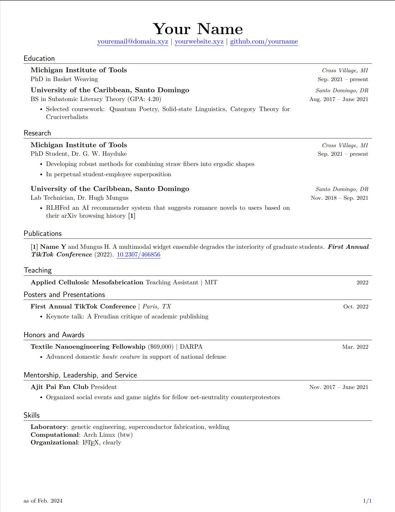

# resume
LaTeX template for my personal resume

Forked from [jakegut/resume](https://github.com/jakegut/resume)

to start, you'll want the `template.tex` file; it's the same as `cv.tex`, just without my personal information.
the template is MIT licensed, so feel free to use/modify it as you like!
sample pic below:

